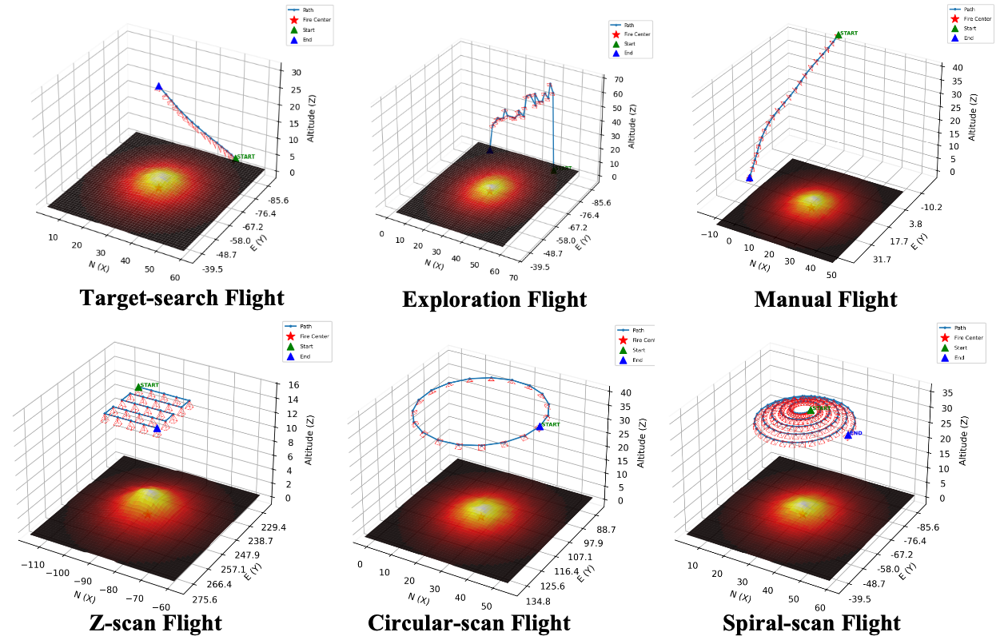

<p align="center">
  <h1 align="center">WildfireX-SLAM</h1>
</p>

<h3 align="center">MMM 2026 (Oral)</h3>

<!-- Authors (edit as needed) -->
<p align="center">
  <a href="https://zhicongsun.github.io/"><strong>Zhicong SUN</strong></a>
  ,
  <a href=""><strong>Jinxing HU</strong></a>
  ,
  <a href=""><strong>Jacqueline LO</strong></a>
</p>
<!-- <p align="center">(* Corresponding Authors)</p> -->

<h3 align="center">
  <a href="https://arxiv.org/abs/2510.27133"><strong>Paper</strong></a>
  | 
  <a href="https://zhicongsun.github.io/wildfirexslam"><strong>Project Page</strong></a>
  |
  <a href="https://docs.google.com/forms/d/e/1FAIpQLSffX-tsr1oIsin76nxWs4YAjIgf2QjCnUWJFvDR1EA6fIs2YA/viewform?usp=dialog"><strong>Dataset</strong></a>
</h3>

<br>


<p align="center">
  <a href="">
    
  </a>
</p>
<p align="center">Overview of the WildfireX-SLAM dataset.</p>
<p align="center">
  <a href="">
    
  </a>
</p>
<p align="center">Diversity of the WildfireX-SLAM dataset.</p>
<br>
<p align="center">
  <a href="">
    
  </a>
</p>
<p align="center">Examples of Path for Data Collection.</p>
<br>

<!-- ## Note -->
This repository contains the **WildfireX-SLAM Dataset** and data collection scripts.

## Contents
- `wildfirex_slam_data_collection.py`: AirSim-based data collection script.
- `wildfirex_slam_data_collection_png.ipynb`: Notebook version of the data collection pipeline.
- `external-libraries/`: Vendored Python dependencies for the AirSim client.


## Acknowledgement
This work incorporates and builds upon open-source projects. We thank the authors for their contributions.
- [AirSim](https://github.com/microsoft/AirSim)
- [Cosys-AirSim](https://github.com/Cosys-Lab/Cosys-AirSim)
- [ProjectAirsim](https://github.com/iamaisim/ProjectAirSim)
- [PromptCraft-Robotics](https://github.com/microsoft/PromptCraft-Robotics)
- [Airsim Agent](https://github.com/maris205/airsim_agent)

## License
WildfireX-SLAM is released under the terms in `LICENSE`.

## Citation
If you find this dataset/code useful, please cite:

```bibtex
@inproceedings{wildfirexslam2026,
  title        = {WildfireX-SLAM: A Large-scale Low-altitude RGB-D Dataset for Wildfire SLAM and Beyond},
  author       = {Zhicong Sun, Jacqueline Lo, Jinxing Hu},
  journal      ={arXiv preprint arXiv:2510.27133},
  year         = {2026},
}
```